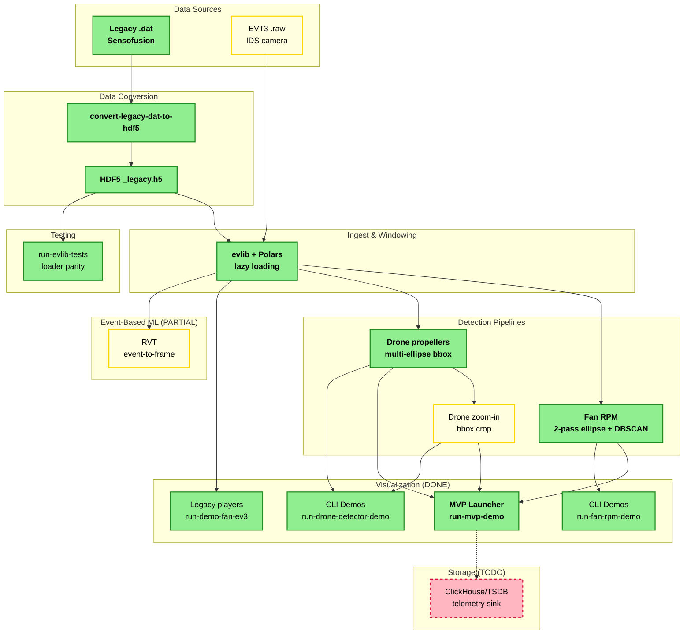

# 03 – Architecture (Current → Target)

## Components by Status

### 🟢 Complete (Green)
- **Data Sources**: Legacy `.dat` files from Sensofusion
- **Data Conversion**: `convert-legacy-dat-to-hdf5` → `_legacy.h5`
- **Ingest**: evlib + Polars lazy loading and windowing
- **Detection**:
  - Fan RPM (2-pass ellipse + DBSCAN + RPM fit)
  - Drone propellers multi-ellipse bounding box detection
- **Visualization**:
  - MVP Launcher (`run-mvp-demo`) - fullscreen UI with all detectors
  - CLI demos (`run-fan-rpm-demo`, `run-drone-detector-demo`)
  - Legacy players (`run-demo-fan-ev3`)
- **Testing**: `run-evlib-tests` (evlib vs legacy parity)

### 🟡 Partial (Yellow)
- **Data Sources**: EVT3 `.raw` (IDS camera - experimental, different from legacy)
- **Detection**: Drone zoom-in feature (bbox crop - incomplete)
- **Event-Based ML**: RVT event-to-frame (runs successfully, retraining failed)

### 🔴 Not Started (Red)
- **Storage**: ClickHouse/TSDB telemetry sink (planned)

See `docs/06_status.md` and `docs/07_runbook.md` for commands
